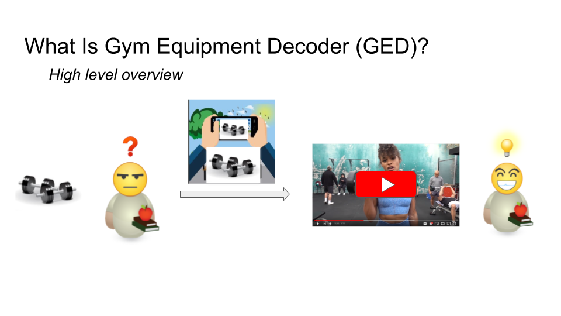
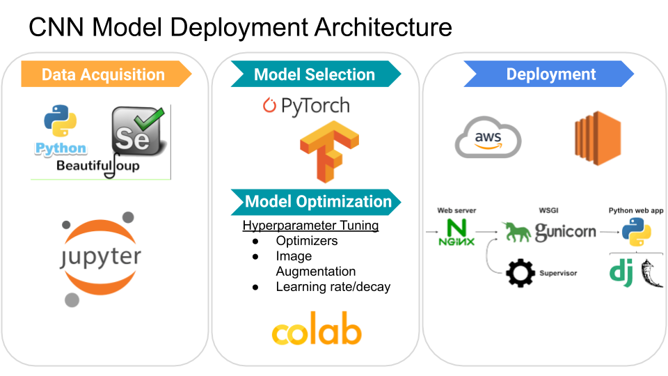
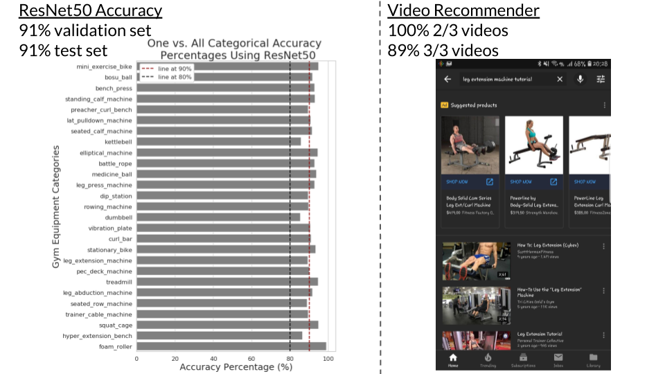

# Project Title: Gym Equipment Decoder
Webapp to help guide users to short video tutorials from pictures of gym equipment taken on their mobile devices
(Gym equipment decoder)[http://computervisionclassifier.me]
(video presentation)[https://www.youtube.com/watch?v=OmrdY8uHJoI]

## Introduction

Working out is good for our health, but gyms can be intimidating with complicated machines. One solution is to hire a personal trainer, but personal trainers are expensive for someone who just want to start. To mitigate this problem, I developed Gym Equipment Decoder as my Insight Data Science project in less than 3 weeks that guides users to short video tutorials on how to use gym equipment properly and safely. 

## Data Product Architecture

The webapp was deployed using Flask, Nginx, Gunicorn and hosted on AWS. The backend of the webapp is a pretrained ConvNet(ResNet50) using transfer learning on Imagenet. The fitness equipment image data was scraped using icrawler then fed into the Pytorch archetecture for classification. Lastly, the string identificaiton of the classified image is then sent to Youtube to give users video tutorials that are under 4 minutes on how to use the gym equipment in question.

## Model Metrics

